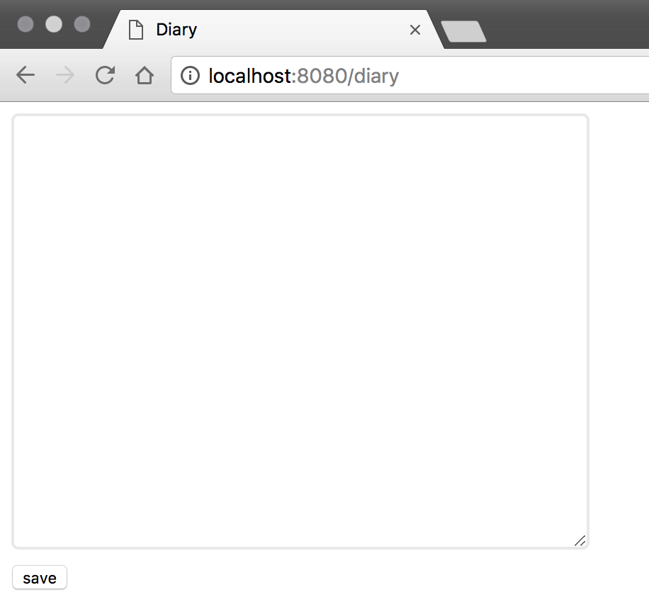

# Ultra Simple Diary

This is the simple diary which can run local PC.  

## Usage

After you clone and move into this repository, you create virtualenv with Python2.7 like this.  

```sh
mkdir venv
virtualenv --no-site-packages venv
source venv/bin/activate
```

Next, you install library from `requirements.txt` like this.

```sh
pip install -r requirements.txt
```

Finally, you run web service like this.

```sh
python main.py
```

You can access with `http://localhost:8080/diary`.  
The diary data are recorded in `save` directory.  



## Licence

* MIT
